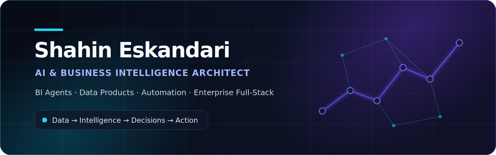

<div align="center">
  

  <br />

  [](README.md)
  [](README.fa.md)

  [](https://www.linkedin.com/in/shahin-eskandari/)
  [](mailto:imshahineskandari@gmail.com)
  [](https://emrooz.school)

  **AI & Business Intelligence Architect · Full-Stack Engineer · Automation Builder**

  *I turn business data, complex workflows, and AI capabilities into reliable products that people can actually use.*
</div>

---

## What I build

I design and build enterprise systems across **Business Intelligence, AI agents, data products, automation, and full-stack platforms**—from semantic analytics and executive dashboards to secure credit infrastructure, operational governance, and multi-tenant products.

My work usually sits at the intersection of:

- **Business intelligence:** KPI systems, CDP, behavioral analytics, WBR, marketing intelligence, menu engineering, and executive reporting
- **AI engineering:** BI Agents, semantic planning, tool-using workflows, evidence evaluation, memory, guardrails, and human approval gates
- **Enterprise software:** Next.js + NestJS platforms, RBAC, auditability, multi-tenancy, provider integrations, and production operations
- **Automation:** ETL, CRM and marketing workflows, reporting pipelines, and repetitive-process elimination

> **کمتر حرف می‌زنم؛ بیشتر می‌سازم.**  
> Less talking. More building.

## Current focus

- Building a trustworthy **BI Agent / GenBI runtime** over governed semantic layers
- Turning enterprise dashboards into **decision and action systems**, not passive reports
- Designing reusable **NestJS + Next.js** foundations for secure business products
- Applying AI to automation without sacrificing evidence, observability, or human control

## Selected systems

<table>
<tr>
<td width="50%" valign="top">

### [BI Agent Runtime](./case-studies/bi-agent-runtime.md)
A definition-driven analytics agent with cognitive states, semantic planning, tool execution, evidence evaluation, memory, guardrails, and controlled transitions.

`LangGraph` `Cube` `NestJS` `Next.js` `PostgreSQL`

</td>
<td width="50%" valign="top">

### [Enterprise BI & CDP Platform](./case-studies/enterprise-bi-cdp.md)
Cross-channel BI for sales, customer behavior, retention, marketing performance, menu engineering, and executive decision-making.

`BI` `CDP` `Analytics` `PostgreSQL` `Power BI`

</td>
</tr>
<tr>
<td width="50%" valign="top">

### [Provider-Agnostic Credit Core](./case-studies/credit-core.md)
A secure orchestration layer for multiple credit providers, standardized errors, OTP workflows, transaction state, RBAC, and operational observability.

`NestJS` `Prisma` `PostgreSQL` `RBAC` `Docker`

</td>
<td width="50%" valign="top">

### [Quality Governance Platform](./case-studies/quality-governance.md)
Enterprise inspections, configurable scoring, CAPA, repeat-violation intelligence, SPC monitoring, analytics, and multi-format reporting.

`Next.js` `NestJS` `RBAC` `CAPA` `SPC`

</td>
</tr>
<tr>
<td width="50%" valign="top">

### [Multi-Tenant Product Platform](./case-studies/multi-tenant-platform.md)
Reusable multi-tenant architecture for branded customer experiences, tenant isolation, custom domains, deployment automation, and scalable operations.

`Next.js` `NestJS` `PostgreSQL` `Traefik` `Docker`

</td>
<td width="50%" valign="top">

### [ChatGPT Persian RTL](https://github.com/shahinesi/chatgpt-persian-rtl)
A lightweight browser extension that intelligently applies RTL only to Persian/Arabic conversation text and the composer while preserving technical content as LTR.

`TypeScript` `Browser Extension` `Manifest V3` `Privacy-first`

</td>
</tr>
</table>

## Selected impact

<table>
<tr>
<td align="center"><strong>1–3 days → seconds</strong><br/>Financial-report preparation automated</td>
<td align="center"><strong>+27%</strong><br/>Branch rating improvement through smart feedback automation</td>
<td align="center"><strong>12</strong><br/>Custom Power BI dashboards delivered as a suite</td>
<td align="center"><strong>500+</strong><br/>Students mentored in marketing and technology</td>
</tr>
</table>

## Selected collaborations & brand environments

Most of my production work is private or company-owned, so public GitHub activity only shows a small part of the real work. These are some of the public-facing brands and business environments I have worked with, built systems around, or supported through BI, automation, software, and data products.

<table>
<tr>
<td width="50%" valign="top"><strong>Shahrfarsh</strong><br/>Credit infrastructure, customer credit pre-check flows, provider integrations, secure operations, and enterprise portal foundations.</td>
<td width="50%" valign="top"><strong>Rouhi / Matinyar Group</strong><br/>Business intelligence, marketing intelligence, CDP, BI Agent concepts, data products, and operational analytics.</td>
</tr>
<tr>
<td width="50%" valign="top"><strong>SnappMarket / SnappFood 360 ecosystem</strong><br/>Marketplace and food-service analytics, dashboard workflows, campaign performance, menu engineering, and operational reporting.</td>
<td width="50%" valign="top"><strong>Sib360</strong><br/>Marketing dashboards, customer analytics, campaign data, and business-performance reporting for digital growth workflows.</td>
</tr>
<tr>
<td width="50%" valign="top"><strong>Atawich</strong><br/>Restaurant and branch-performance analytics, marketing operations, customer behavior, and decision-support reporting.</td>
<td width="50%" valign="top"><strong>SYBT Group / QC360</strong><br/>Enterprise BI, quality governance, CAPA/SPC analytics, inspection systems, and executive reporting platforms.</td>
</tr>
<tr>
<td width="50%" valign="top"><strong>IranGoosht</strong><br/>Financial reporting automation and operational reporting pipelines that reduced manual preparation time from days to seconds.</td>
<td width="50%" valign="top"><strong>Private B2B, retail & operations teams</strong><br/>Internal tools, dashboards, process automation, CRM workflows, integrations, and deployment systems for private environments.</td>
</tr>
</table>

## Core stack

<div align="center">


</div>

**AI & semantic systems:** LangGraph, Cube semantic layer, Vercel AI SDK, prompt engineering, tool orchestration, memory, evaluation, guardrails  
**BI & data:** SQL, DAX, Power Query, Metabase, ETL, CDP, marketing analytics, behavioral analytics  
**Platform & operations:** Prisma, Docker Compose, Traefik, GitHub Actions, Linux, observability, API integrations, n8n

## How I engineer

```text
Discover reality → Model the domain → Design the contract → Implement incrementally
→ Validate evidence → Observe production → Improve without breaking trust
```

- **Discovery-first:** inspect the real data, codebase, contracts, and constraints before designing
- **Evidence-driven:** analytical and AI outputs must be traceable to data and tool evidence
- **Secure by default:** authorization, auditability, error boundaries, and secret hygiene are architectural concerns
- **Reusable foundations:** solve the shared platform problem once, then keep domain logic explicit
- **Controlled autonomy:** high-risk AI and engineering workflows use phase gates, validation, and circuit breakers

## Open-source work

- **[ChatGPT Persian RTL](https://github.com/shahinesi/chatgpt-persian-rtl)** — focused Persian/Arabic RTL support for ChatGPT Web
- **[Nest + Next Enterprise Dashboard Core](https://github.com/shahinesi/nest-next-dashboard-core)** — reusable full-stack enterprise dashboard foundation
- **[Express + Pug + Bootstrap Starter](https://github.com/shahinesi/express-pug-bootstrap-starter)** — server-rendered Node.js starter

## Private & Enterprise Portfolio

Most of my production work lives in private repositories and company-owned environments. The source code cannot be published because of confidentiality, security, and ownership constraints, but the systems below represent the majority of my hands-on engineering work.

### AI, BI & Data Products

- **Enterprise Marketing Intelligence Platform** — Cross-channel analytics for sales, campaign performance, customer behavior, retention, menu engineering, operational KPIs, and executive decision-making.
- **AI-Powered BI Agent Runtime** — A governed analytics agent with semantic planning, tool execution, evidence evaluation, memory, guardrails, and mandatory human approval gates.
- **Customer Data & Behavioral Analytics Engine** — Customer segmentation, purchase-pattern analysis, churn and retention measurement, cohort intelligence, and marketing optimization.
- **Executive Performance Management Suite** — WBR, MPM, KPI governance, branch and channel comparisons, anomaly detection, and management reporting across multiple business units.
- **Enterprise Dashboard Portfolio** — A suite of custom Power BI and web-based dashboards for finance, sales, marketing, customer experience, quality, and operations.

### Enterprise Platforms & Financial Systems

- **Provider-Agnostic Credit Orchestration Core** — Secure integration layer for multiple credit providers, authentication, OTP workflows, transaction lifecycle management, standardized errors, auditability, and operational observability.
- **Customer Credit Pre-Check Portal** — Customer-facing and administrative platform for credit eligibility checks, secure core integration, role-based access, session management, and traceable operational flows.
- **Quality Governance & Inspection Platform** — Enterprise inspections, configurable scoring, CAPA workflows, repeat-violation intelligence, SPC monitoring, analytics, and multi-format reporting.
- **Multi-Tenant Digital Experience Platform** — Tenant isolation, branded customer experiences, custom domains, branch-level configuration, deployment automation, and scalable operations.
- **Reusable Enterprise Application Foundation** — Next.js and NestJS core with authentication, RBAC, policies, sessions, audit logs, reusable UI, and production-readiness foundations.

### Automation, Integrations & Operations

- **Financial Reporting Automation Engine** — Automated ingestion, transformation, reconciliation, and reporting workflows that reduced report preparation from days to seconds.
- **Smart CRM Feedback Automation** — Automated customer-feedback and engagement workflows connected to operational data, improving branch ratings and response quality.
- **Real-Time Order Integration Services** — Reliable data pipelines and integration services for synchronizing order, customer, branch, channel, and operational data.
- **Marketing Campaign & Gamification Systems** — Campaign execution, segmentation, engagement mechanics, performance tracking, and automated customer journeys.
- **Payroll & Internal Process Automation** — Workflow automation for repetitive administrative, reporting, and operational processes with validation and traceability.
- **Private Infrastructure & Deployment Systems** — Dockerized deployments, Traefik routing, environment separation, secure networking, observability, backup practices, and production operations.

> These projects are intentionally presented with public-facing product names instead of internal repository or client identifiers.

## Background

I hold a **Master’s degree in Artificial Intelligence** and a Bachelor’s degree in Software Technology Engineering. My career spans software development, business intelligence, marketing analytics, product building, automation, infrastructure, and technical education.

<div align="center">
  <br />
  <strong>Data → Intelligence → Decisions → Action</strong>
  <br /><br />
  <sub>Built with a bias toward useful systems, measurable outcomes, and maintainable architecture.</sub>
</div>