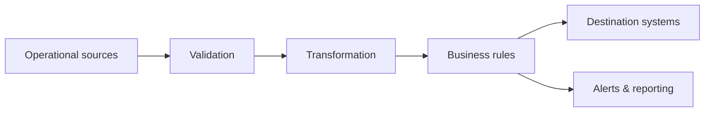

# Automation & Data Pipelines

## Focus

Automation projects across finance, CRM, marketing, reporting, and operational workflows.

## Examples

- ETL-based transformation of third-party financial reports into accounting-system formats
- Automated customer-feedback flows using personalized links and SMS
- CRM and marketing triggers with conditional routing and API integrations
- Real-time and scheduled order synchronization
- Automated KPI calculation and multi-dimensional reporting
- Spreadsheet and document generation for operational teams

## Outcomes

Well-designed automation reduces repetitive work, but the larger value is consistency: validation, traceability, recoverability, and a shared definition of what the process should do.

## Typical stack

`Node.js` · `Python` · `SQL` · `REST APIs` · `n8n` · `Excel automation` · `Scheduled jobs`
