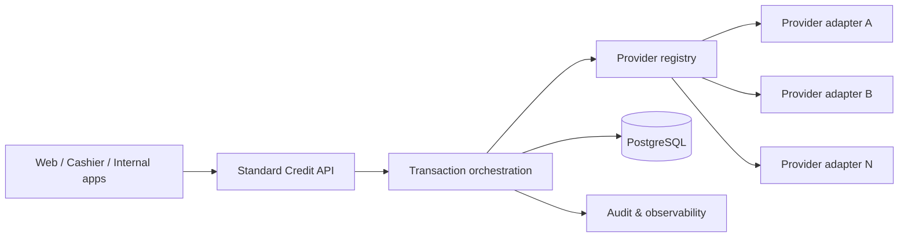

# Provider-Agnostic Credit Core

> Architecture case study. Provider credentials, client identifiers, contracts, and production endpoints are not included.

## Problem

Credit providers expose different authentication schemes, OTP behavior, error codes, transaction states, request formats, and operational constraints. Coupling every consumer application directly to each provider creates fragile code and inconsistent customer experiences.

## Architecture

## Core responsibilities

- Standard API contract for consumers
- Provider adapter registry and credential isolation
- Normalized domain error codes and public HTTP mappings
- OTP send, retry, expiration, attempt-limit, and finalization workflows
- Explicit transaction-state guards
- Idempotency and traceable operation history
- RBAC and CASL-based authorization for administrative capabilities
- Encrypted provider credentials with masked display and rotation workflows
- Structured request/response logging with sensitive-data controls

## Stack

`NestJS` · `Prisma` · `PostgreSQL` · `TypeScript` · `Docker` · `Traefik`

## Key principle

Consumer applications depend on the **credit domain contract**, not on provider-specific quirks. Provider differences are translated at the boundary.
