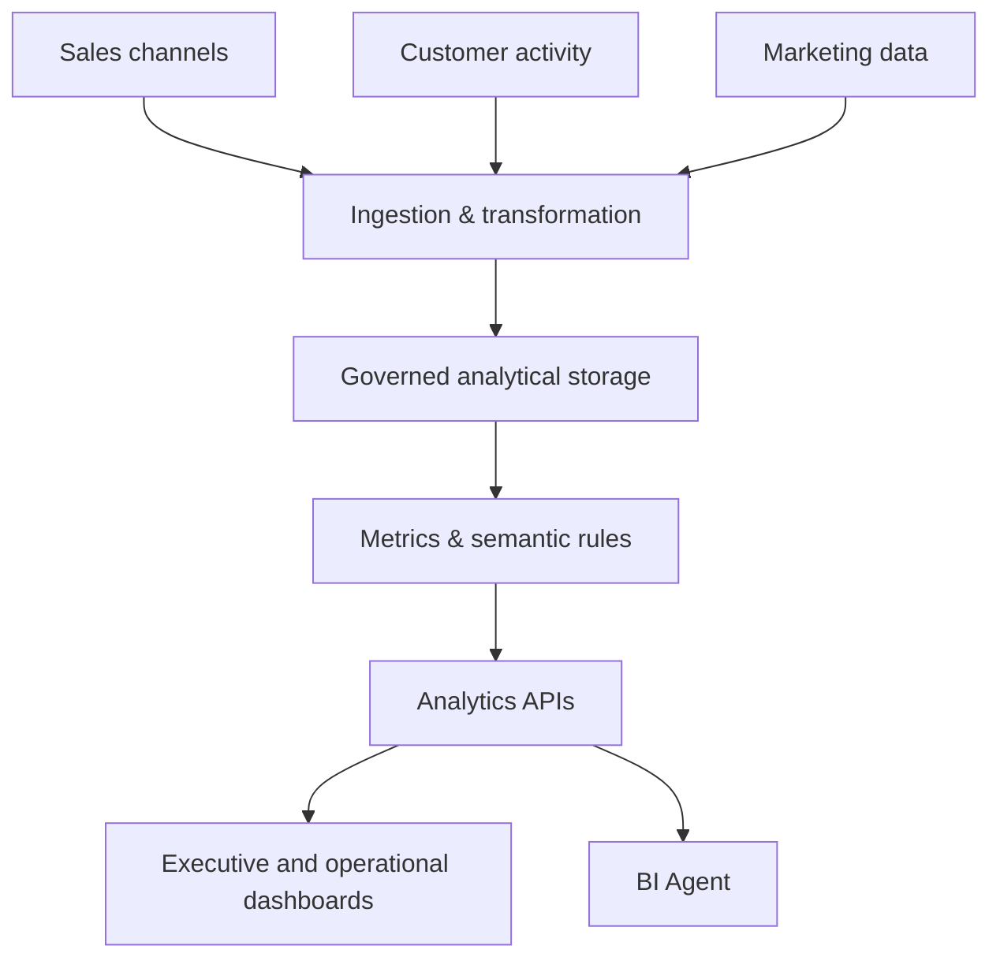

# Enterprise BI & CDP Platform

> Public architecture overview. Business data, client names, credentials, and proprietary calculations are intentionally omitted.

## Scope

An enterprise marketing-intelligence and BI platform designed to unify operational, sales, customer, and channel data into one analytical environment.

## Major domains

- Executive sales and WBR reporting
- Marketing Performance Monitoring (MPM)
- Cross-channel performance across in-store, website, marketplace, and third-party channels
- Customer Data Platform (CDP) and behavioral analytics
- Retention, loyalty, churn, purchase recurrence, and customer lifecycle analysis
- Basket composition and complementary-product intelligence
- Menu engineering using profitability and popularity classification
- Promotion, advertising-cost, organic-order, and ROI analysis

## Design considerations

- Clear distinction between all-channel customer behavior and channel-specific behavior
- Pre-aggregation and rollups for predictable cold and warm query performance
- Cache policies tuned for interactive dashboards
- Date, branch, channel, category, and item filters with consistent semantics
- Auditable metric definitions instead of duplicated calculations across screens
- Read-only analytical integration with operational data sources

## Stack

`PostgreSQL` · `SQL` · `NestJS` · `Next.js` · `Power BI` · `Metabase` · `ETL`
