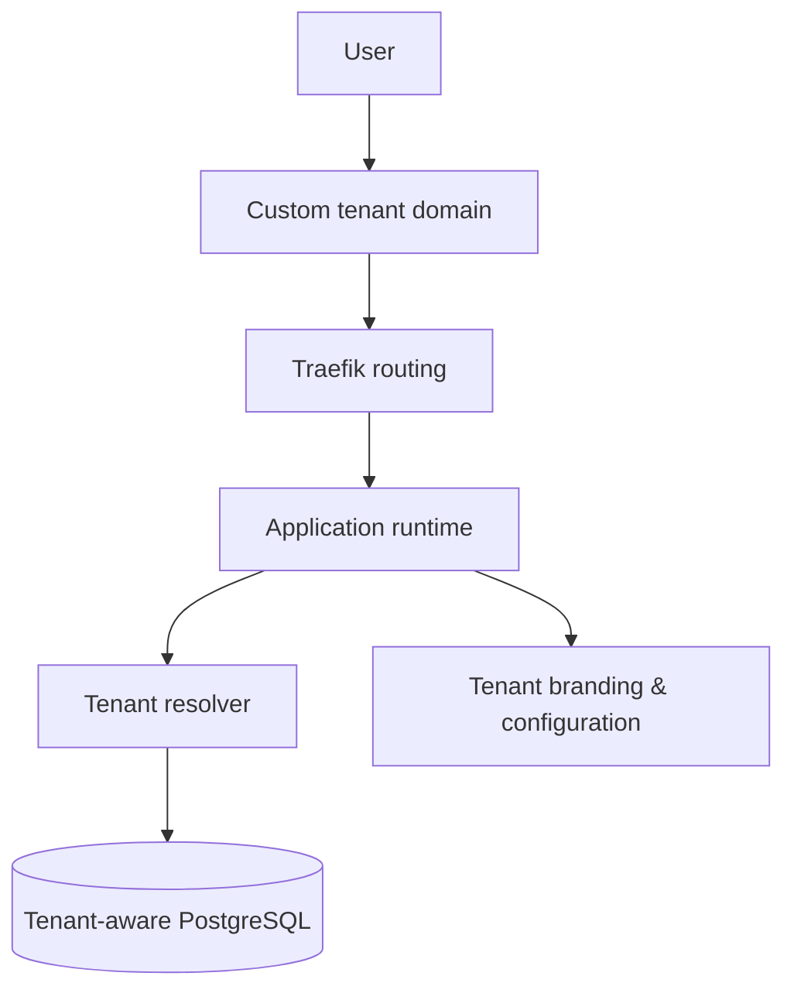

# Multi-Tenant Product Platform

> Reusable architectural overview; tenant data and production configuration are excluded.

## Goal

Build one product that can serve multiple brands or customers while keeping identity, data, domains, configuration, and operational boundaries explicit.

## Architecture

## Platform concerns

- Tenant resolution from domain and trusted request context
- Data isolation and tenant-aware authorization
- Custom branding, menus, content, and feature configuration
- Secure administrative workflows
- Custom-domain routing and TLS automation
- Repeatable Docker Compose deployment and operational runbooks
- Auditability and safe migration paths

## Stack

`Next.js` · `NestJS` · `PostgreSQL` · `Docker Compose` · `Traefik` · `Let's Encrypt`

## Principle

Multi-tenancy is not a theme switch. It is a cross-cutting boundary that must be represented in identity, data access, authorization, routing, observability, and deployment.
