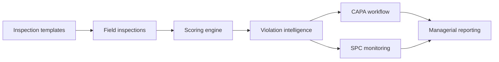

# Quality Governance Platform

> High-level case study with confidential organizational and inspection data removed.

## Scope

An enterprise inspection, compliance, and operational-quality platform for distributed organizations and branch networks.

## Capabilities

- Configurable inspection templates and field workflows
- OTP/password authentication and RBAC-based access governance
- Automated scoring and managerial analytics
- CAPA lifecycle management for corrective and preventive actions
- Repeat-violation detection with configurable penalty coefficients
- SPC-based monitoring and proactive risk signals
- Activity logs and traceable operational history
- Excel, PDF, and image reporting
- Branch, inspector, template, and time-based analysis

## Product outcome

The platform moves inspection work from isolated forms and manual follow-up into a centralized governance system with ownership, prioritization, corrective action, and measurable visibility.

## Stack

`Next.js` · `NestJS` · `PostgreSQL` · `RBAC` · `CAPA` · `SPC`
